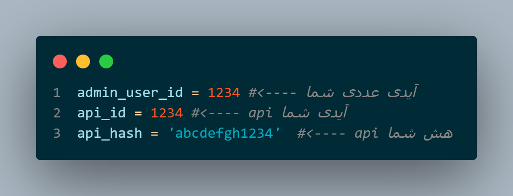

# سلف تلگرام
[](https://github.com/MhdiTaheri/TelegramSelf)
[](./LICENSE)
[](https://github.com/MhdiTaheri/TelegramSelf/issues)
[](https://github.com/MhdiTaheri/TelegramSelf/stargazers)

[](https://github.com/MhdiTaheri/TelegramSelf/pulls)

> [!IMPORTANT]  
> در صورت استفاده نادرست و دلیت شدن اکانت شما بنده هیچ مسئولیتی در این مورد ندارم

> [!TIP]  
> ربات حدود 1 سال پیش ساخته شده و تا قبل پابلیش شدن مشکلی نداشته در صورت پیدا کردن مشکل در قسمت issues تاپیک مرتبط درج کنید تا در اثرا وقت مشکل رفع شود

## نصب و آماده سازی

```
git clone https://github.com/MhdiTaheri/TelegramSelf.git
```
```
cd TelegramSelf
```
```
pip install -r requirements.txt
```
سپس به مسیر ``lib/Information.py`` بروید و مانند تصویر زیر **جا های مشخص شده را ادیت کنید** : 
<div align="center"></div>

## اجرا

بعد انجام این کار **دستور** اجرا کنید و تمام:
```
python3 main.py
```

اگر با بستن ترمینال سلف شما **آف** میشد میتونید از دستور استفاده کنید:
```
nohup python3 main.py &
```

## حرف آخر
با اینکه آپشن تایم نیم و بیو هست ولی **اگر نیاز دارید ساعت رو بدونید لطفا به بالای صفحه گوشی خودتون یا پایین مانیتور نگاه کنید، تلگرام برای نمایش ساعت در بیو و اسم ساخته نشده!**
